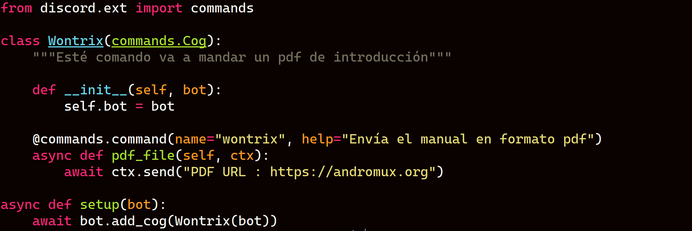

- Para mantener el bot en segundo plano lee esta documentación:
[https://pm2.keymetrics.io/](https://pm2.keymetrics.io/docs/usage/process-management/)

# 1) ¿Dónde van los comandos y cómo se cargan?

* Todos tus comandos van en **archivos .py** dentro de la carpeta `comandos/`.
* Cada archivo define un **Cog** (una clase) que agrupa funciones decoradas como comandos.
* **No necesitas tocar `bot.py`**: ya tienes un cargador automático que importa todo lo que esté en `comandos/*.py` (excepto `__*.py`).
* Asegúrate de que `comandos/` tenga un `__init__.py` (puede estar vacío) para que sea un paquete importable.

Estructura mínima:

```
discord_bot/
│── bot.py           ← motor (no se toca)
│── .env             ← aquí va tu token (no subir a GitHub)
│── requirements.txt
│── comandos/
│   ├── __init__.py
│   ├── 00_ayuda.py  ← ayuda elegante (ya hecho)
│   ├── 01_saludo.py
│   ├── 02_info.py
│   ├── 03_canal_youtube.py
│   ├── 05_redessociales.py
│   └── 06_comando.py  ← lo nuevo
```

---

# 2) Crea `comandos/06_comando.py`



Este archivo trae **tres ejemplos** de comandos:

* `!hola` → básico.
* `!suma <a> <b>` → con parámetros y validación de tipos.
* `!eco <texto libre>` → cómo capturar el resto del mensaje.

Además incluye **manejo de errores** para guiar al usuario cuando se equivoca.

```python
# comandos/06_comando.py
import discord
from discord.ext import commands

class Comando(commands.Cog):
    """
    Este Cog agrupa comandos de ejemplo para aprender:
    - Cómo definir un comando simple
    - Cómo aceptar argumentos con tipos
    - Cómo capturar texto libre
    - Cómo manejar errores del usuario
    """

    def __init__(self, bot: commands.Bot):
        self.bot = bot

    # 1) Comando básico
    # - @commands.command registra la función como comando
    # - name: cómo lo escribirá el usuario en Discord
    # - help: descripción que verá en !ayuda
    @commands.command(name="hola", help="El bot te saluda por tu nombre")
    async def hola(self, ctx: commands.Context):
        # ctx (Context) trae info del mensaje, autor, canal, etc.
        await ctx.send(f"👋 ¡Hola, {ctx.author.mention}!")

    # 2) Comando con parámetros y tipos
    # - a: float y b: float → discord.py intentará convertir desde el texto
    # - aliases: sinónimos del comando
    @commands.command(
        name="suma",
        help="Suma dos números. Uso: !suma 2 3",
        aliases=["add", "sumar"]
    )
    async def suma(self, ctx: commands.Context, a: float, b: float):
        resultado = a + b
        await ctx.send(f"➕ {a} + {b} = **{resultado}**")

    # Manejo de errores específico para !suma
    @suma.error
    async def suma_error(self, ctx: commands.Context, error):
        # Si el usuario escribió mal (texto donde iban números, o faltan args)
        if isinstance(error, commands.BadArgument):
            await ctx.send("❗ Debes escribir **dos números**. Ejemplo: `!suma 2 3`")
        elif isinstance(error, commands.MissingRequiredArgument):
            await ctx.send("❗ Faltan argumentos. Uso correcto: `!suma 2 3`")
        else:
            # Otro error no esperado (útil mientras desarrollas)
            await ctx.send(f"⚠️ Ocurrió un error: `{error.__class__.__name__}`")

    # 3) Comando que captura "todo el resto" del mensaje
    # - El asterisco * antes del nombre del parámetro indica "consume todo lo demás"
    @commands.command(
        name="eco",
        help="Repite el texto que escribas. Uso: !eco tu mensaje aquí"
    )
    async def eco(self, ctx: commands.Context, *, texto: str):
        await ctx.send(texto)

# El setup es lo que permite que bot.py cargue este Cog automáticamente
async def setup(bot: commands.Bot):
    await bot.add_cog(Comando(bot))
```

---

## 3) Qué significa cada parte (para principiantes)

* `class Comando(commands.Cog)`: defines un **Cog** (grupo de comandos).
* `async def hola(self, ctx)`: funciones **async** porque Discord es asíncrono.
* `ctx` (**Context**): trae información del mensaje, el canal, el autor, el prefijo, etc. Ejemplos:

  * `ctx.send("texto")` → responder en el canal.
  * `ctx.author`, `ctx.guild`, `ctx.channel`.
* `@commands.command(...)`: **decorador** que registra la función como comando.

  * `name="hola"` → cómo lo invoca el usuario: `!hola`.
  * `help="..."` → texto que mostrará el `!ayuda`.
  * `aliases=["..."]` → sinónimos del comando (por ejemplo `!add` y `!sumar`).
* **Parámetros con tipo** (ej. `a: float`): si no puede convertir, lanza error y entra a tu manejador `@suma.error`.
* `*, texto: str` → el `*` indica “toma todo lo que sigue como un solo string”.

> 💡 Tip útil: si quieres que **no aparezca** un comando en `!ayuda`, usa `@commands.command(hidden=True, ...)`.

---

# 4) ¿Tengo que tocar `00_ayuda.py`?

Con la versión de ayuda **anterior** que te dejé (la que recorre `self.bot.commands`), **no necesitas tocar nada**:
`!ayuda` **detecta automáticamente** los nuevos comandos y los muestra con su `help`.

Si quieres que salgan **ordenados alfabéticamente**, cambia el loop dentro de `00_ayuda.py` así:

```python
# Dentro del comando ayuda:
for comando in sorted(self.bot.commands, key=lambda c: c.name):
    if comando.hidden:
        continue
    embed.add_field(
        name=f"❯ {ctx.prefix}{comando.name}",
        value=comando.help or "Sin descripción",
        inline=False
    )
```

Opcionalmente puedes **ocultar** algunos comandos de sistema con `hidden=True`.

---

# 5) Recordatorio importante: NO toques `bot.py`

* Tu `bot.py` ya es el **constructor/núcleo** del bot.
* Carga automáticamente todo lo de `comandos/`.
* Maneja el token, los intents y la salida con colores.
* Si mañana agregas `comandos/07_lo_que_sea.py`, **lo carga solo**.

---

# 6) Subir a GitHub sin exponer tu token

Nunca subas tu token real. Haz esto:

**`.env` (local, NO subir):**

```env
DISCORD_TOKEN=tu_token_real_aqui
```

**`.env.example` (sí subir):**

```env
DISCORD_TOKEN=pon_tu_token_aqui
```

**`.gitignore` (sí subir):**

```
# Entornos
.venv/
venv/
__pycache__/

# Archivos sensibles
.env
.env.*
```

Para que tu bot pueda ejecutar correctamente el comando `!roms` tal como lo tienes en tu ejemplo, y sobre todo que funcione enviando **mensajes privados (DMs)** y usando **botones interactivos**, el bot necesita ciertos **permisos** y consideraciones tanto en el **servidor** como en la **configuración de Discord**. Aquí te detallo:

---

## 1️⃣ Permisos mínimos en el servidor

Aunque el comando principal se envía por DM, el bot también envía un **mensaje de aviso en el canal** opcional:

```python
if ctx.guild:  
    await ctx.send(f"📥 {ctx.author.mention}, te he enviado la lista de ROMs por DM.")
```

Para eso, el bot necesita:

* **Enviar mensajes** (`Send Messages`) → para enviar cualquier mensaje en canales de texto.
* **Leer mensajes / Ver canales** (`Read Messages / View Channel`) → para recibir los comandos de los usuarios.

Si no quieres el aviso en el canal, puedes eliminar esa línea y no necesitas permisos de servidor adicionales.

---

## 2️⃣ Para que funcione correctamente el envío de DMs

* El bot no necesita permisos especiales, pero:

  * El usuario **debe permitir DMs de miembros del servidor**.
  * Si el usuario bloquea DMs del servidor, el bot no podrá enviarle los embeds y mostrará el error:

    ```python
    except discord.Forbidden:
        await ctx.send(f"⚠️ {ctx.author.mention}, no pude enviarte un DM. Revisa tu configuración de privacidad.")
    ```

---

## 3️⃣ Para botones interactivos (`discord.ui.Button`)

* **No se necesitan permisos adicionales**.
* Los botones funcionan dentro del mensaje enviado, incluso en DMs.
* Lo importante es que **cada usuario solo pueda manipular sus propios botones**, lo cual ya manejas con:

```python
if interaction.user != ctx.author:
    await interaction.response.send_message("❌ Solo puedes manipular tu propia lista.", ephemeral=True)
```

---

## 4️⃣ Resumen de permisos recomendados para el bot

| Función                       | Permiso necesario               | Comentario                                    |
| ----------------------------- | ------------------------------- | --------------------------------------------- |
| Leer comandos                 | `Read Messages / View Channels` | Necesario para recibir `!roms` en el servidor |
| Responder en canal (opcional) | `Send Messages`                 | Solo si quieres avisar que enviaste DM        |
| Interactuar en DM             | Ninguno especial                | Depende de la configuración del usuario       |
| Botones                       | Ninguno especial                | Funciona en mensajes normales o DMs           |

---

## 5️⃣ Recomendación adicional

* Al invitar el bot a un servidor, puedes usar este **scope y permisos**:

```
https://discord.com/oauth2/authorize?client_id=TU_CLIENT_ID&scope=bot&permissions=3072
```

* Donde `3072` incluye:

  * `Read Messages / View Channel` → 1024
  * `Send Messages` → 2048

* Esto cubre lo mínimo necesario para este comando sin dar permisos innecesarios.

---
